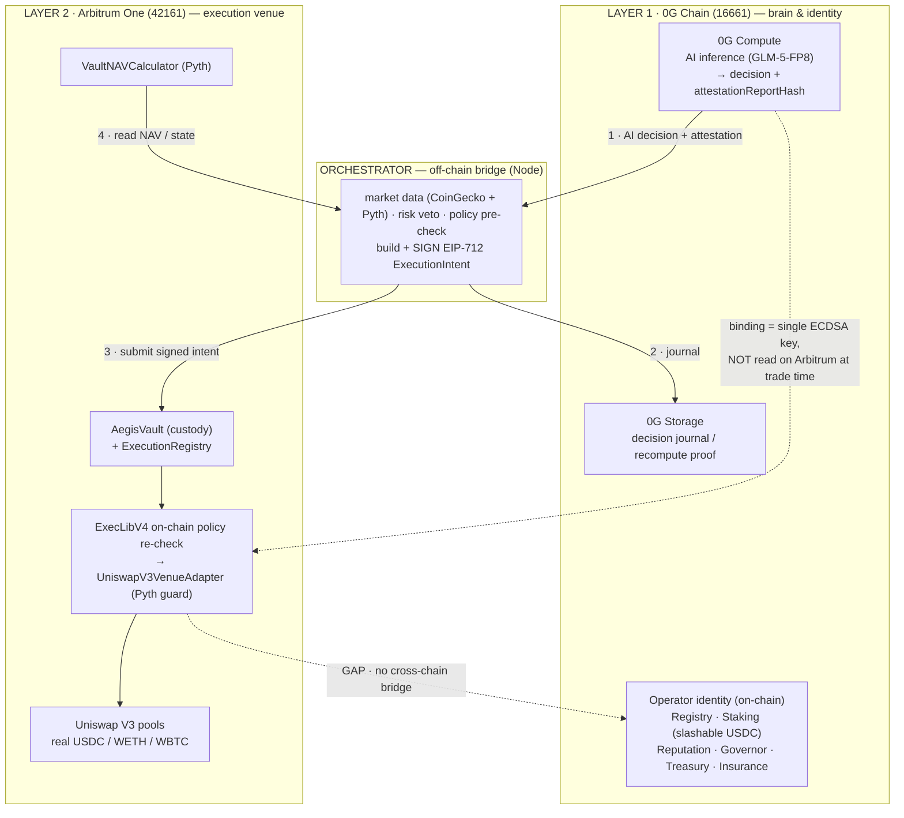

# Aegis — 2-Layer Architecture (0G ↔ Orchestrator ↔ Arbitrum)

> Hybrid deployment per `orchestrator/src/config/chains.js`:
> **0G Chain (16661) = verification / identity + AI compute · Arbitrum One (42161) = execution venue.**
> Solid arrows = built & real. Dashed arrows = a link that is described but **not yet wired on-chain**.

```
┌──────────────────────────────────────────────────────────────────────────────┐
│  LAYER 1 · 0G CHAIN (16661)  —  "the brain & the identity"                     │
│                                                                                │
│   0G COMPUTE                 0G STORAGE              0G IDENTITY CONTRACTS       │
│   AI inference (GLM-5-FP8)   decision journal       OperatorRegistry           │
│   → decision +              (recompute / proof)     OperatorStaking (slashable) │
│     attestationReportHash                           OperatorReputation         │
│                                                     AegisGovernor · Treasury    │
│                                                     · InsurancePool             │
└──────┬────────────────────────────▲───────────────────────────▲───────────────┘
       │ (1) AI decision             │ (2) journal                ┊ (GAP) record
       │     + attestation           │                            ┊ trade result to
       ▼                             │                            ┊ 0G reputation —
┌──────┴─────────────────────────────┴────────────────────────────┴─────────────┐
│  ORCHESTRATOR  (off-chain Node service)  —  "the bridge / the hands"           │
│                                                                                │
│   market data (CoinGecko + Pyth) → risk veto → policy pre-check                │
│   → build + SIGN  EIP-712 ExecutionIntent  (binds attestationReportHash)       │
└──────┬───────────────────────────────────────────────────────▲────────────────┘
       │ (3) submit signed intent                                │ (4) read vault
       ▼                                                         │     state / NAV
┌──────┴──────────────────────────────────────────────────────────┴─────────────┐
│  LAYER 2 · ARBITRUM ONE (42161)  —  "the execution venue"                      │
│                                                                                │
│   AegisVault (custody)  ──▶  ExecLibV4  (on-chain policy RE-CHECK)             │
│   ExecutionRegistry          ──▶  UniswapV3VenueAdapter  (Pyth deviation guard)│
│   VaultNAVCalculator (Pyth)    ──▶  Uniswap V3 pools (real USDC / WETH / WBTC) │
└────────────────────────────────────────────────────────────────────────────────┘

   ──▶ built / real link        ┄┄▶ gap (not yet enforced on-chain)

   ⚠ The "verifiable inference" binding is a single ECDSA signature, NOT a TEE
     quote — and Arbitrum execution reads NO 0G proof at trade time. So 0G holds
     the brain + identity; the cross-chain trust link is the off-chain key, not chain state.
```

## Where each 0G technology is used after going to Arbitrum

| 0G technology | Still used? | Which part |
|---|---|---|
| **0G Compute** (AI inference) | ✅ unchanged | Off-chain brain — produces every BUY/SELL/HOLD decision (chain-agnostic) |
| **0G Storage** (journal) | ✅ when enabled | Decision/attestation audit-trail + recompute proof |
| **0G Chain identity contracts** | ✅ stay on 0G (not duplicated) | OperatorRegistry · Staking (slashable USDC) · Reputation · Governor · Treasury · Insurance |
| **TEE attestation signer** | ✅ same scheme | Signs the AI output hash; EIP-712 domain only swaps `chainId` |

**Moves to Arbitrum:** vault custody · `ExecutionRegistry` · `UniswapV3VenueAdapter` (Pyth guard) · `VaultNAVCalculator` · Uniswap V3 liquidity.

## Honest gaps in the cross-chain binding (today)
1. **Verifiable-inference is a single key, not on-chain proof** — no SGX/TDX quote is parsed; Arbitrum execution does not consume any 0G state.
2. **No reputation bridge** — an Arbitrum trade cannot yet record back to 0G `OperatorReputation` (needs a relay).
3. **Khalani cross-chain settlement** is scaffolded, not active.

> **Honest pitch line:** *"0G is where the agent thinks and where its stake is slashable; Arbitrum is where it trades real liquidity."* — not *"verifiable AI inference bound to on-chain execution."*

---

## Mermaid (renderable — paste into a `.md`, GitHub, or mermaid.live → export PNG/SVG)


