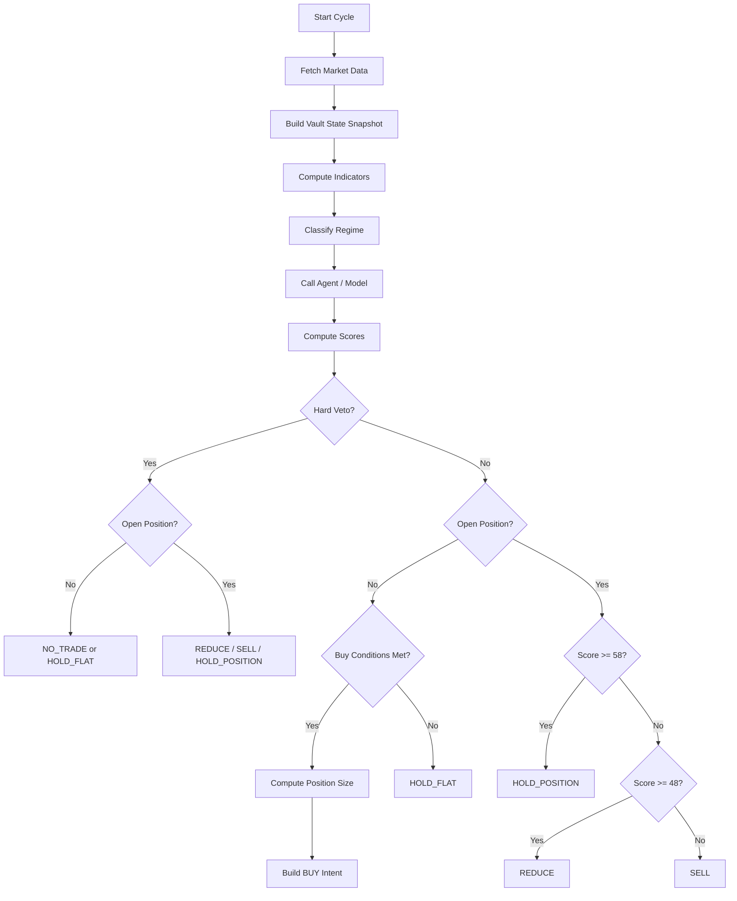
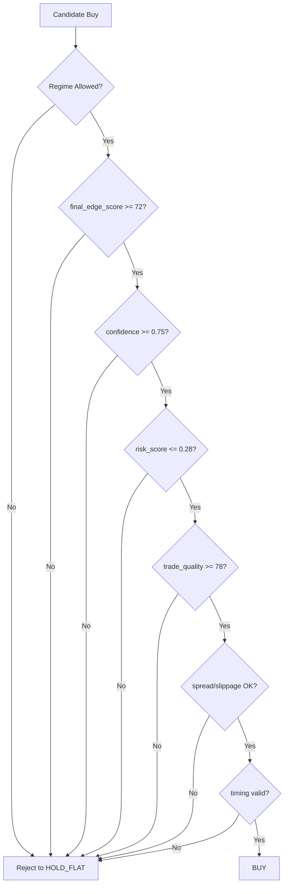
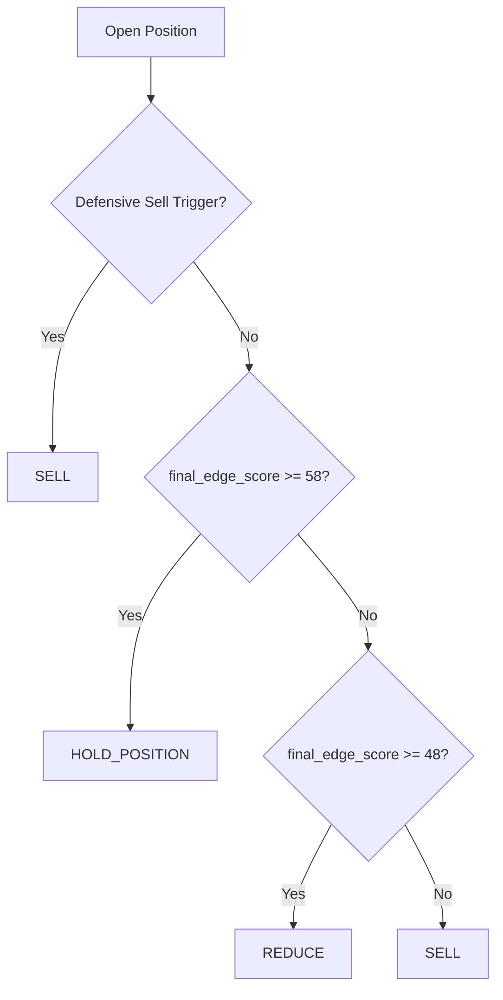

# Aegis Vault — Decision Matrix Buy / Sell / Hold v1

## 1. Tujuan Dokumen

Dokumen ini menyusun **decision matrix Buy / Sell / Hold v1** yang sangat konkret untuk **Aegis Vault**, agar bisa langsung dipakai oleh **orchestrator** untuk:

- membaca kondisi market,
- menentukan kapan **Buy**,
- menentukan kapan **Sell / Reduce**,
- menentukan kapan **Hold / No Trade**,
- menentukan **ukuran posisi**,
- menerapkan **risk veto**,
- dan menghasilkan **JSON output** yang dapat langsung divalidasi sebelum dibentuk menjadi execution intent.

Dokumen ini dirancang konsisten dengan prinsip Aegis Vault sebagai:

> **AI-guided, rules-constrained, regime-aware trading vault**

Fokus utamanya adalah membuat sistem lebih **andal**, **tidak mudah overtrade**, **tidak mudah flip buy/sell karena noise**, dan tetap **mudah didemokan**.

---

## 2. Prinsip Inti v1

Decision engine v1 mengikuti 6 prinsip inti:

1. **AI tidak pernah menjadi otoritas tunggal**.
2. **Semua keputusan harus melewati hard risk veto layer**.
3. **Buy / Sell / Hold ditentukan oleh gabungan rule + score + regime**.
4. **Hold adalah aksi aktif**, bukan keadaan pasif.
5. **Masuk dan keluar memakai hysteresis** agar tidak flip terus-menerus.
6. **Position sizing harus dinamis**, bukan fixed size.

---

## 3. Output yang Harus Dihasilkan Engine

Setiap siklus evaluasi, decision engine harus menghasilkan salah satu dari aksi berikut:

- `BUY`
- `SELL`
- `REDUCE`
- `HOLD_POSITION`
- `HOLD_FLAT`
- `NO_TRADE`

Agar v1 tetap sederhana di UI, frontend bisa menampilkan 3 kategori besar:

- **Buy** → `BUY`
- **Sell** → `SELL`, `REDUCE`
- **Hold** → `HOLD_POSITION`, `HOLD_FLAT`, `NO_TRADE`

---

## 4. Data Input Minimum untuk Orchestrator

Sebelum memanggil agent / model, orchestrator harus lebih dulu membangun input terstruktur berikut.

### 4.1 Market Inputs

```json
{
  "symbol": "BTC/USDC",
  "price": 68420.15,
  "ema_20": 68110.22,
  "ema_50": 67502.41,
  "ema_200": 64880.91,
  "rsi_14": 61.2,
  "macd_histogram": 45.82,
  "atr_14_pct": 1.92,
  "realized_vol_1h_pct": 2.31,
  "volume_zscore": 1.28,
  "spread_bps": 8,
  "slippage_estimate_bps": 18,
  "distance_to_local_resistance_pct": 1.9,
  "distance_to_local_support_pct": 3.8,
  "price_vs_vwap_pct": 0.74,
  "mtf_alignment": "bullish"
}
```

### 4.2 Vault State Inputs

```json
{
  "vault_equity_usd": 10000,
  "base_asset": "USDC",
  "current_position_side": "flat",
  "current_position_notional_usd": 0,
  "current_position_pnl_pct": 0,
  "last_action": "HOLD_FLAT",
  "last_execution_at": 1712345678,
  "daily_pnl_pct": -1.2,
  "rolling_drawdown_pct": 2.8,
  "consecutive_losses": 1,
  "actions_last_60m": 1,
  "time_since_last_trade_sec": 2200,
  "open_intents": 0
}
```

### 4.3 Policy Inputs

```json
{
  "allowed_assets": ["BTC", "ETH"],
  "max_position_bps": 1800,
  "max_daily_loss_bps": 300,
  "stop_loss_bps": 220,
  "take_profit_bps": 450,
  "trail_stop_bps": 180,
  "cooldown_seconds": 900,
  "max_actions_per_60m": 2,
  "min_confidence_buy": 0.75,
  "min_confidence_reduce_or_sell": 0.55,
  "max_risk_score_buy": 0.28,
  "max_slippage_bps": 30,
  "max_spread_bps": 20,
  "pause": false
}
```

---

## 5. Struktur Decision Engine v1

Decision engine v1 dibagi menjadi 6 layer:

1. **Precompute Indicators**
2. **Regime Classification**
3. **Signal Scoring**
4. **Risk Veto Layer**
5. **Action Decision Layer**
6. **Position Sizing + Intent Builder**

---

## 6. Regime Classification v1

Sebelum menentukan Buy / Sell / Hold, sistem harus lebih dulu mengklasifikasikan market regime.

### 6.1 Regime yang Dipakai

- `TREND_UP_STRONG`
- `TREND_UP_WEAK`
- `RANGE_STABLE`
- `RANGE_NOISY`
- `TREND_DOWN_WEAK`
- `TREND_DOWN_STRONG`
- `PANIC_VOLATILE`
- `LOW_LIQUIDITY`

### 6.2 Threshold Regime

#### A. TREND_UP_STRONG
Pilih jika semua terpenuhi:

- `price > ema_20 > ema_50 > ema_200`
- `rsi_14` antara `58` dan `74`
- `macd_histogram > 0`
- `atr_14_pct <= 2.8`
- `mtf_alignment == bullish`

#### B. TREND_UP_WEAK
Pilih jika:

- `price > ema_20 > ema_50`
- `ema_50 >= ema_200`
- `rsi_14` antara `52` dan `65`
- `macd_histogram >= 0`
- `atr_14_pct <= 3.2`

#### C. RANGE_STABLE
Pilih jika:

- `abs(price - ema_50) / ema_50 <= 0.015`
- `rsi_14` antara `42` dan `58`
- `atr_14_pct <= 2.0`
- tidak memenuhi syarat trend up/down kuat

#### D. RANGE_NOISY
Pilih jika:

- `rsi_14` antara `40` dan `60`
- `atr_14_pct` antara `2.0` dan `3.8`
- struktur EMA tidak rapi / saling berdekatan
- `mtf_alignment == mixed`

#### E. TREND_DOWN_WEAK
Pilih jika:

- `price < ema_20 < ema_50`
- `ema_50 <= ema_200`
- `rsi_14` antara `35` dan `48`
- `macd_histogram <= 0`

#### F. TREND_DOWN_STRONG
Pilih jika semua terpenuhi:

- `price < ema_20 < ema_50 < ema_200`
- `rsi_14` antara `20` dan `42`
- `macd_histogram < 0`
- `atr_14_pct <= 3.0`
- `mtf_alignment == bearish`

#### G. PANIC_VOLATILE
Pilih jika salah satu terpenuhi:

- `atr_14_pct > 3.8`
- `realized_vol_1h_pct > 4.2`
- candle expansion ratio ekstrem
- spread/slippage meningkat tajam

#### H. LOW_LIQUIDITY
Pilih jika salah satu terpenuhi:

- `spread_bps > 20`
- `slippage_estimate_bps > 30`
- depth tidak memadai
- volume turun ekstrem

### 6.3 Regime Priority Order

Jika beberapa regime cocok, pakai prioritas berikut:

1. `LOW_LIQUIDITY`
2. `PANIC_VOLATILE`
3. `TREND_UP_STRONG`
4. `TREND_DOWN_STRONG`
5. `TREND_UP_WEAK`
6. `TREND_DOWN_WEAK`
7. `RANGE_NOISY`
8. `RANGE_STABLE`

---

## 7. Signal Scoring v1

Setelah regime ditentukan, sistem menghitung skor numerik.

### 7.1 Subscores

Semua subscore menggunakan rentang `0–100`.

#### A. Trend Score

Penilaian:

- `+30` jika `price > ema_20`
- `+20` jika `ema_20 > ema_50`
- `+20` jika `ema_50 > ema_200`
- `+15` jika slope ema_20 positif
- `+15` jika slope ema_50 positif

Clamp hasil ke `0–100`.

#### B. Momentum Score

Penilaian:

- `+25` jika `rsi_14 >= 55 && rsi_14 <= 70`
- `+15` jika `rsi_14 > 70` tapi belum ekstrem
- `+20` jika `macd_histogram > 0`
- `+20` jika histogram meningkat dibanding window sebelumnya
- `+20` jika `price_vs_vwap_pct > 0`

#### C. Volatility Suitability Score

Tujuan score ini bukan “semakin volatil semakin bagus”, tetapi menilai apakah volatilitas **masih layak diperdagangkan**.

- `100` jika `atr_14_pct <= 2.0`
- `80` jika `2.0 < atr_14_pct <= 2.6`
- `60` jika `2.6 < atr_14_pct <= 3.2`
- `35` jika `3.2 < atr_14_pct <= 3.8`
- `10` jika `atr_14_pct > 3.8`

#### D. Liquidity / Execution Score

Mulai dari `100`, lalu kurangi:

- `-2 * spread_bps`
- `-1.5 * slippage_estimate_bps`
- `-10` jika depth tipis
- `-10` jika route tidak stabil

Clamp hasil ke `0–100`.

#### E. Risk State Score

Mulai dari `100`, lalu kurangi:

- `-10 * consecutive_losses`
- `-2 * abs(daily_pnl_pct)` jika negatif
- `-3 * rolling_drawdown_pct`
- `-15` jika `actions_last_60m >= 2`
- `-15` jika `time_since_last_trade_sec < cooldown_seconds`

Clamp hasil ke `0–100`.

#### F. AI Context Score

Didapat dari model / agent, juga dalam skala `0–100`, berdasarkan:

- clarity of setup,
- regime suitability,
- confidence consistency,
- entry timing quality,
- absence of contradictory signals.

### 7.2 Bobot Final

Gunakan formula:

```text
final_edge_score =
  0.25 * trend_score +
  0.20 * momentum_score +
  0.15 * volatility_score +
  0.15 * liquidity_score +
  0.15 * risk_state_score +
  0.10 * ai_context_score
```

Hasil dibulatkan ke skala `0–100`.

---

## 8. Hysteresis Thresholds v1

Agar sistem tidak flip terus-menerus, gunakan ambang masuk / tahan / keluar yang berbeda.

### 8.1 Threshold Utama

- **Enter Buy Threshold**: `72`
- **Stay-in-Position Threshold**: `58`
- **Reduce Threshold**: `52`
- **Exit Threshold**: `48`

### 8.2 Makna Threshold

- `>= 72` → setup cukup kuat untuk masuk posisi baru
- `58–71` → posisi existing boleh ditahan, tetapi jangan tambah
- `52–57` → posisi mulai dilemahkan / reduce
- `< 48` → keluar penuh atau no-trade

---

## 9. Hard Risk Veto Layer v1

Layer ini dieksekusi **sebelum** action final diputuskan.

Jika salah satu veto aktif, maka sistem **tidak boleh buy** meski final score tinggi.

### 9.1 Hard Veto Conditions

Set `hard_veto = true` bila salah satu terpenuhi:

1. `pause == true`
2. asset tidak ada di whitelist
3. `open_intents > 0`
4. `time_since_last_trade_sec < cooldown_seconds`
5. `actions_last_60m >= max_actions_per_60m`
6. `daily_pnl_pct <= -(max_daily_loss_bps / 100)`
7. `rolling_drawdown_pct >= 6.0`
8. `consecutive_losses >= 3`
9. `spread_bps > max_spread_bps`
10. `slippage_estimate_bps > max_slippage_bps`
11. `atr_14_pct > 3.8`
12. market data stale
13. route / venue degraded
14. `confidence < 0.55`
15. `risk_score > 0.45`

### 9.2 Effect of Hard Veto

Jika `hard_veto = true`, action hanya boleh menjadi salah satu dari:

- `HOLD_FLAT`
- `HOLD_POSITION`
- `REDUCE`
- `SELL`
- `NO_TRADE`

`BUY` dilarang.

---

## 10. Soft Filters v1

Soft filter tidak langsung memblokir trade, tetapi menurunkan kualitas setup.

### 10.1 Soft Filter Conditions

- `distance_to_local_resistance_pct < 1.2` untuk long entry
- `rsi_14 > 72`
- `price_vs_vwap_pct > 1.5`
- volume tidak mendukung breakout
- multi-timeframe alignment mixed
- market baru saja spike satu candle tanpa retest

Jika 2 atau lebih soft filter aktif, kurangi:

- `trade_quality_score - 10`
- `size_multiplier - 0.15`

---

## 11. Decision Matrix Buy / Sell / Hold v1

## 11.1 BUY Matrix

### BUY hanya boleh terjadi jika semua syarat inti terpenuhi:

1. `hard_veto == false`
2. `regime` adalah salah satu:
   - `TREND_UP_STRONG`
   - `TREND_UP_WEAK`
   - `RANGE_STABLE` **hanya jika** support reversal valid
3. `final_edge_score >= 72`
4. `confidence >= 0.75`
5. `risk_score <= 0.28`
6. `trade_quality_score >= 78`
7. `current_position_side == flat`
8. `slippage_estimate_bps <= 30`
9. `spread_bps <= 20`
10. `consecutive_losses <= 1`

### BUY timing conditions

Minimal salah satu harus terpenuhi:

- breakout + retest valid
- dua candle close di atas resistance minor
- price above VWAP + volume mendukung
- dip ke ema20 lalu memantul di trend up

### BUY size bands

- confidence `0.75–0.80` → `size_bps = 500–800`
- confidence `0.81–0.87` → `size_bps = 900–1200`
- confidence `> 0.87` → `size_bps = 1200–1500`

Tetap tidak boleh melebihi `max_position_bps` policy.

---

## 11.2 SELL Matrix

SELL dibagi menjadi 3 jenis.

### A. Defensive SELL

Trigger SELL penuh jika salah satu terpenuhi:

- `current_position_pnl_pct <= -(stop_loss_bps / 100)`
- `rolling_drawdown_pct >= 6.0`
- `atr_14_pct > 4.2`
- `confidence < 0.40`
- `risk_score > 0.55`
- regime berubah menjadi `TREND_DOWN_STRONG` atau `PANIC_VOLATILE`
- venue abnormal / market data rusak

### B. Tactical SELL

Trigger SELL penuh jika semua terpenuhi:

- `final_edge_score < 48`
- `confidence < 0.55`
- momentum rusak
- price turun di bawah ema20 dan gagal reclaim

### C. Profit Realization SELL

Jika posisi untung:

- `current_position_pnl_pct >= 2.5` dan score turun di bawah `58` → trim / reduce
- `current_position_pnl_pct >= 4.5` dan momentum melemah → SELL atau reduce besar
- trailing stop tersentuh → SELL

---

## 11.3 REDUCE Matrix

Gunakan `REDUCE` saat posisi existing belum harus ditutup penuh, tetapi edge melemah.

### REDUCE jika semua terpenuhi:

1. `current_position_side != flat`
2. `final_edge_score >= 48 && final_edge_score < 58`
3. `confidence >= 0.50 && confidence < 0.65`
4. regime bukan `TREND_UP_STRONG`
5. tidak ada defensive sell trigger

### Besaran reduce

- reduce `25%` posisi jika score `54–57`
- reduce `50%` posisi jika score `50–53`
- reduce `75%` posisi jika score `48–49`

---

## 11.4 HOLD Matrix

### HOLD_POSITION

Pilih `HOLD_POSITION` jika semua terpenuhi:

1. `current_position_side != flat`
2. `final_edge_score >= 58`
3. `confidence >= 0.60`
4. `risk_score <= 0.40`
5. tidak ada hard veto yang memaksa exit

### HOLD_FLAT

Pilih `HOLD_FLAT` jika semua terpenuhi:

1. `current_position_side == flat`
2. `final_edge_score >= 52 && final_edge_score < 72`
3. atau `confidence >= 0.55 && confidence < 0.75`
4. atau regime = `RANGE_NOISY`
5. tidak ada setup timing yang valid

### NO_TRADE

Pilih `NO_TRADE` jika:

- `hard_veto == true`
- atau regime = `LOW_LIQUIDITY`
- atau regime = `PANIC_VOLATILE`
- atau data stale

---

## 12. Decision Table Ringkas

| Kondisi | Action |
|---|---|
| hard veto aktif + flat | NO_TRADE |
| hard veto aktif + ada posisi | HOLD_POSITION / REDUCE / SELL sesuai severity |
| regime bullish + score >= 72 + confidence >= 0.75 + risk_score <= 0.28 + timing valid | BUY |
| ada posisi + score >= 58 | HOLD_POSITION |
| ada posisi + score 48–57 | REDUCE |
| ada posisi + score < 48 | SELL |
| flat + score 52–71 tapi timing belum valid | HOLD_FLAT |
| regime noisy / panic / low liquidity | HOLD_FLAT / NO_TRADE |

---

## 13. Trade Quality Score v1

Trade quality dipakai sebagai filter akhir sebelum intent dibentuk.

### 13.1 Formula

```text
trade_quality_score =
  0.30 * final_edge_score +
  0.20 * execution_score +
  0.20 * timing_score +
  0.15 * regime_suitability_score +
  0.15 * confidence_score_scaled
```

### 13.2 Threshold

- `>= 78` → execute normal
- `70–77` → execute small only
- `60–69` → hold
- `< 60` → reject / no trade

---

## 14. Position Sizing v1

Gunakan sizing dinamis berikut.

### 14.1 Base Formula

```text
position_size_bps =
  base_size_bps * confidence_multiplier * volatility_multiplier * drawdown_multiplier
```

### 14.2 Rekomendasi Nilai

#### base_size_bps
- conservative: `700`
- balanced: `1000`
- aggressive: `1300`

#### confidence_multiplier
- `0.75–0.80` → `0.8`
- `0.81–0.87` → `1.0`
- `> 0.87` → `1.15`

#### volatility_multiplier
- `atr <= 2.0` → `1.0`
- `2.0 < atr <= 2.8` → `0.9`
- `2.8 < atr <= 3.2` → `0.75`
- `> 3.2` → `0.5`

#### drawdown_multiplier
- `rolling_drawdown_pct < 2` → `1.0`
- `2–4` → `0.8`
- `4–6` → `0.6`
- `> 6` → `0.0`

### 14.3 Final Clamp

- minimum size: `300 bps`
- recommended normal max: `1500 bps`
- hard cap: `max_position_bps` dari policy

---

## 15. Flow Chart v1

## 15.1 High-Level Decision Flow



## 15.2 Buy Gate Flow



## 15.3 Position Management Flow



---

## 16. JSON Output Schema untuk Agent

Output agent harus selalu terstruktur dan mudah divalidasi.

## 16.1 Schema Ringkas

```json
{
  "version": "1.0",
  "timestamp": 1712345678,
  "symbol": "BTC/USDC",
  "regime": "TREND_UP_STRONG",
  "action": "BUY",
  "bias": "BULLISH",
  "confidence": 0.82,
  "risk_score": 0.24,
  "trend_score": 84,
  "momentum_score": 79,
  "volatility_score": 80,
  "liquidity_score": 88,
  "risk_state_score": 91,
  "ai_context_score": 76,
  "final_edge_score": 83,
  "timing_score": 81,
  "trade_quality_score": 82,
  "size_bps": 1100,
  "execution_mode": "MARKETABLE_SWAP",
  "entry_trigger": "breakout_retest_confirmed",
  "exit_plan": {
    "stop_loss_bps": 220,
    "take_profit_bps": 450,
    "trail_stop_bps": 180,
    "reduce_at_score_below": 58,
    "full_exit_at_score_below": 48
  },
  "hard_veto": false,
  "hard_veto_reasons": [],
  "soft_flags": ["near_minor_resistance"],
  "reason_summary": "Bullish trend remains intact, breakout has been retested, execution conditions remain acceptable, and risk state is healthy.",
  "ttl_sec": 180,
  "recommended_asset_in": "USDC",
  "recommended_asset_out": "BTC"
}
```

## 16.2 Allowed Enum Values

### action
- `BUY`
- `SELL`
- `REDUCE`
- `HOLD_POSITION`
- `HOLD_FLAT`
- `NO_TRADE`

### regime
- `TREND_UP_STRONG`
- `TREND_UP_WEAK`
- `RANGE_STABLE`
- `RANGE_NOISY`
- `TREND_DOWN_WEAK`
- `TREND_DOWN_STRONG`
- `PANIC_VOLATILE`
- `LOW_LIQUIDITY`

### bias
- `BULLISH`
- `BEARISH`
- `NEUTRAL`

### execution_mode
- `MARKETABLE_SWAP`
- `WAIT_RETEST`
- `WAIT_BREAKOUT_CONFIRMATION`
- `DO_NOT_EXECUTE`

---

## 17. JSON Examples per Action

## 17.1 BUY Example

```json
{
  "version": "1.0",
  "timestamp": 1712345678,
  "symbol": "BTC/USDC",
  "regime": "TREND_UP_STRONG",
  "action": "BUY",
  "bias": "BULLISH",
  "confidence": 0.84,
  "risk_score": 0.22,
  "final_edge_score": 81,
  "trade_quality_score": 84,
  "size_bps": 1200,
  "execution_mode": "MARKETABLE_SWAP",
  "entry_trigger": "dip_to_ema20_bounce",
  "hard_veto": false,
  "hard_veto_reasons": [],
  "reason_summary": "Trend and momentum remain aligned across timeframes, volatility is acceptable, and entry timing is validated.",
  "ttl_sec": 180,
  "recommended_asset_in": "USDC",
  "recommended_asset_out": "BTC"
}
```

## 17.2 HOLD_FLAT Example

```json
{
  "version": "1.0",
  "timestamp": 1712345678,
  "symbol": "BTC/USDC",
  "regime": "RANGE_NOISY",
  "action": "HOLD_FLAT",
  "bias": "NEUTRAL",
  "confidence": 0.63,
  "risk_score": 0.31,
  "final_edge_score": 61,
  "trade_quality_score": 64,
  "size_bps": 0,
  "execution_mode": "DO_NOT_EXECUTE",
  "entry_trigger": "none",
  "hard_veto": false,
  "hard_veto_reasons": [],
  "reason_summary": "Signals are mixed and regime is noisy, so preserving capital is preferable to forcing an entry.",
  "ttl_sec": 180,
  "recommended_asset_in": "USDC",
  "recommended_asset_out": "BTC"
}
```

## 17.3 HOLD_POSITION Example

```json
{
  "version": "1.0",
  "timestamp": 1712345678,
  "symbol": "BTC/USDC",
  "regime": "TREND_UP_WEAK",
  "action": "HOLD_POSITION",
  "bias": "BULLISH",
  "confidence": 0.69,
  "risk_score": 0.29,
  "final_edge_score": 62,
  "trade_quality_score": 68,
  "size_bps": 0,
  "execution_mode": "DO_NOT_EXECUTE",
  "entry_trigger": "hold_existing",
  "hard_veto": false,
  "hard_veto_reasons": [],
  "reason_summary": "Position remains valid but setup is not strong enough to add aggressively.",
  "ttl_sec": 180,
  "recommended_asset_in": "USDC",
  "recommended_asset_out": "BTC"
}
```

## 17.4 REDUCE Example

```json
{
  "version": "1.0",
  "timestamp": 1712345678,
  "symbol": "BTC/USDC",
  "regime": "TREND_UP_WEAK",
  "action": "REDUCE",
  "bias": "BULLISH",
  "confidence": 0.58,
  "risk_score": 0.36,
  "final_edge_score": 51,
  "trade_quality_score": 57,
  "size_bps": 500,
  "reduce_fraction_bps": 5000,
  "execution_mode": "MARKETABLE_SWAP",
  "entry_trigger": "score_deterioration",
  "hard_veto": false,
  "hard_veto_reasons": [],
  "reason_summary": "Trend is weakening and quality has fallen below hold threshold, so partial de-risking is recommended.",
  "ttl_sec": 180,
  "recommended_asset_in": "BTC",
  "recommended_asset_out": "USDC"
}
```

## 17.5 SELL Example

```json
{
  "version": "1.0",
  "timestamp": 1712345678,
  "symbol": "BTC/USDC",
  "regime": "PANIC_VOLATILE",
  "action": "SELL",
  "bias": "BEARISH",
  "confidence": 0.41,
  "risk_score": 0.63,
  "final_edge_score": 36,
  "trade_quality_score": 35,
  "size_bps": 10000,
  "execution_mode": "MARKETABLE_SWAP",
  "entry_trigger": "defensive_exit",
  "hard_veto": true,
  "hard_veto_reasons": ["panic_volatility", "risk_score_too_high"],
  "reason_summary": "Risk conditions have deteriorated sharply and capital preservation now takes priority over staying exposed.",
  "ttl_sec": 120,
  "recommended_asset_in": "BTC",
  "recommended_asset_out": "USDC"
}
```

---

## 18. Validation Rules untuk Orchestrator

Sebelum JSON output agent dipakai, orchestrator wajib melakukan validasi berikut.

### 18.1 Schema Validation

- semua field wajib ada
- enum valid
- angka berada pada rentang yang benar
- `confidence` harus `0.0–1.0`
- `risk_score` harus `0.0–1.0`
- `final_edge_score` harus `0–100`
- `size_bps` harus `0–max_position_bps`

### 18.2 Logical Validation

- jika `action == BUY`, maka `hard_veto` wajib `false`
- jika `action == BUY`, `size_bps > 0`
- jika `action == HOLD_*`, `execution_mode` sebaiknya `DO_NOT_EXECUTE`
- jika `action == SELL`, asset_in dan asset_out harus terbalik terhadap posisi
- jika `ttl_sec <= 0`, reject

### 18.3 Policy Validation

- asset whitelist
- cooldown
- max action frequency
- max daily loss
- pause status
- max position cap
- slippage cap
- spread cap

---

## 19. Pseudocode untuk Orchestrator

```ts
function decideAction(input: DecisionInput): AgentDecision {
  const indicators = computeIndicators(input.market);
  const regime = classifyRegime(indicators, input.market);
  const agentView = callModel({
    market: input.market,
    vault: input.vault,
    policy: input.policy,
    regime
  });

  const trendScore = computeTrendScore(indicators);
  const momentumScore = computeMomentumScore(indicators);
  const volatilityScore = computeVolatilityScore(indicators);
  const liquidityScore = computeLiquidityScore(input.market);
  const riskStateScore = computeRiskStateScore(input.vault, input.policy);
  const aiContextScore = clamp(agentView.ai_context_score, 0, 100);

  const finalEdgeScore = round(
    0.25 * trendScore +
    0.20 * momentumScore +
    0.15 * volatilityScore +
    0.15 * liquidityScore +
    0.15 * riskStateScore +
    0.10 * aiContextScore
  );

  const hardVeto = evaluateHardVeto(input, agentView, regime);
  const tradeQualityScore = computeTradeQualityScore({
    finalEdgeScore,
    executionScore: liquidityScore,
    timingScore: agentView.timing_score,
    regimeSuitabilityScore: regimeSuitability(regime),
    confidenceScoreScaled: agentView.confidence * 100
  });

  if (hardVeto) {
    return handleVetoPath(input, regime, finalEdgeScore, agentView);
  }

  if (input.vault.current_position_side === "flat") {
    return decideFlatPath(input, regime, finalEdgeScore, tradeQualityScore, agentView);
  }

  return decideOpenPositionPath(input, regime, finalEdgeScore, tradeQualityScore, agentView);
}
```

---

## 20. Recommended Defaults v1

Untuk MVP solo builder, berikut default yang disarankan:

### Conservative
- `max_position_bps = 1000`
- `stop_loss_bps = 180`
- `take_profit_bps = 320`
- `trail_stop_bps = 150`
- `cooldown_seconds = 1200`
- `max_actions_per_60m = 1`

### Balanced
- `max_position_bps = 1500`
- `stop_loss_bps = 220`
- `take_profit_bps = 450`
- `trail_stop_bps = 180`
- `cooldown_seconds = 900`
- `max_actions_per_60m = 2`

### Aggressive
- `max_position_bps = 1800`
- `stop_loss_bps = 250`
- `take_profit_bps = 550`
- `trail_stop_bps = 220`
- `cooldown_seconds = 600`
- `max_actions_per_60m = 2`

---

## 21. Apa yang Harus Ditampilkan di UI

Agar decision engine mudah dijelaskan, dashboard sebaiknya menampilkan:

1. **Current Regime**
2. **Final Edge Score**
3. **Confidence**
4. **Risk Score**
5. **Trade Quality Score**
6. **Hard Veto Status**
7. **Action Recommendation**
8. **Position Size Recommendation**
9. **Reason Summary**
10. **Why not Buy / Why not Sell**

Contoh label yang baik:

- `Regime: Trend Up Strong`
- `Action: BUY`
- `Confidence: 0.84`
- `Risk Score: 0.22`
- `Trade Quality: 84/100`
- `Position Size: 12.0%`
- `Reason: Breakout retest confirmed, volatility acceptable, no veto active`

---

## 22. Kesimpulan Implementasi v1

Decision matrix v1 ini membuat Aegis Vault lebih handal karena:

- tidak bergantung pada satu sinyal,
- tidak membiarkan AI langsung mengeksekusi tanpa filter,
- punya definisi **Buy** yang ketat,
- punya definisi **Sell** yang terstruktur,
- punya definisi **Hold** yang aktif,
- memakai **hysteresis** untuk menghindari flip noise,
- dan menghasilkan **JSON output** yang bisa langsung dipakai orchestrator.

Versi v1 ini sangat cocok untuk MVP karena masih cukup sederhana untuk dibangun, tetapi sudah cukup kuat untuk:

- demo day,
- audit log,
- policy enforcement,
- dan transisi ke v2 yang lebih adaptif.

---

## 23. Langkah Lanjutan yang Paling Direkomendasikan

Setelah v1 ini, dokumen berikut yang paling berguna adalah:

1. `orchestrator-implementation-spec.md`
2. `agent-prompt-spec.md`
3. `execution-intent-schema.md`
4. `backtest-evaluation-framework.md`

